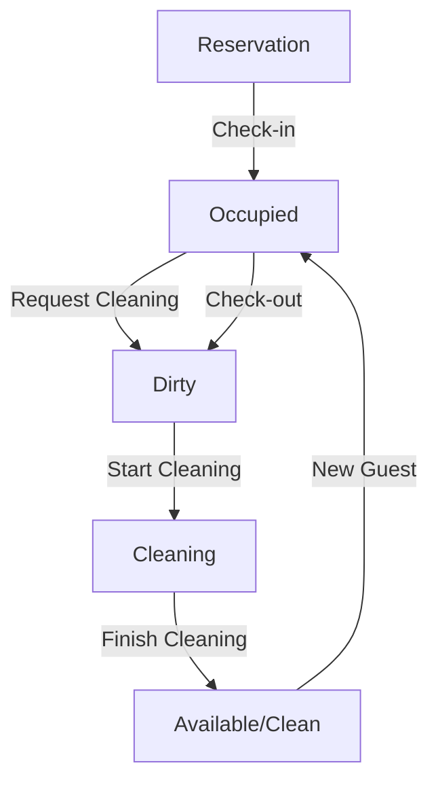

# Hospitality Management System (HMS) Design

This document outlines the architecture, database schema, and workflows for a comprehensive Hospitality Management System built on ERPNext v14, inspired by Oracle Hospitality (Opera).

## 1. System Architecture

The HMS is designed as a modular app within the ERPNext ecosystem, leveraging core modules for finance, stock, and HR.

### Core Modules & Integrations:
- **PMS (Property Management System):** Manages Hotels, Rooms, Guests, and Reservations.
- **Front Desk:** Handles Check-in, Check-out, and Folio management.
- **Housekeeping:** Tracks room status, cleaning tasks, and logs.
- **POS (Point of Sale):** Integrated with ERPNext POS for Restaurants/Bars.
- **Inventory:** Leverages ERPNext `Stock` for tracking F&B and room supplies.
- **Accounting:** Integrates with ERPNext `Accounts` for invoicing, payments, and taxes.
- **HR:** Uses ERPNext `HR` for staff management, shifts, and payroll.

## 2. Database Schema (DocTypes)

### Hotel Management
- **Hotel:** (Linked to `Company`) Name, Code, Location, Contact.
- **Room Type:** Name, Description, Capacity, Base Rate, Amenities.
- **Room:** Room Number, Room Type, Floor, Status (Available, Occupied, Dirty, Cleaning, Maintenance), Housekeeping User.
- **Guest:** (Linked to `Customer`) Profile, Identity Docs, Loyalty Points, History.
- **Reservation:** Guest, Room(s), Check-in/Check-out dates, Status (Tentative, Confirmed, Checked-in, Checked-out, Cancelled), Total Amount, Deposit.
- **Guest Folio:** Reservation, Date, Description, Amount, Posting Reference (Sales Invoice), Payment Status.

### Housekeeping
- **Housekeeping Task:** Room, Assigned To (Employee), Task Type (Full Clean, Touch up, Turndown), Priority, Status.
- **Housekeeping Log:** Room, User, Action (Marked Dirty, Started Cleaning, Finished Cleaning), Timestamp, Duration (calculated).

### Restaurant / POS
- **POS Table:** Table Number, Capacity, Section.
- **POS Order:** Table, Waiter, Items, Special Instructions, Link to Guest Folio (for Room Service).

## 3. Workflows

### Reservation to Check-out
1. **Reservation:** Guest makes a booking -> `Reservation` created (Status: Confirmed).
2. **Check-in:** Guest arrives -> Room assigned -> `Reservation` status updated to `Checked-in` -> `Room` status becomes `Occupied`.
3. **During Stay:** Room service or POS charges added to `Guest Folio`.
4. **Housekeeping:** `Room` status changes: `Occupied` -> `Dirty` (after stay or daily) -> `Cleaning` -> `Available` (if vacant) or `Occupied` (if stay continues).
5. **Check-out:** Guest leaves -> Folio settled (Sales Invoice created) -> `Reservation` status: `Checked-out` -> `Room` status: `Dirty`.

### Housekeeping Workflow (Detailed)
1. **Trigger Dirty:** System automatically marks room `Dirty` upon Check-out or at a scheduled time.
2. **Assign Task:** Housekeeping Supervisor assigns a `Housekeeping Task` to an attendant.
3. **Start Cleaning:** Attendant updates room status to `Cleaning` (Timestamp recorded).
4. **Finish Cleaning:** Attendant updates room status to `Available` (Timestamp recorded).
5. **Log Entry:** Each transition is captured in `Housekeeping Log` for reporting.

## 4. Housekeeping Log Report
A script report will calculate:
- `Cleaning Start Time`: When status changed to `Cleaning`.
- `Cleaning End Time`: When status changed to `Available/Cleaned`.
- `Duration`: `End Time` - `Start Time`.
- `Trigger User`: The user who marked the room `Dirty`.

## 5. Integration Points
- **Sales Invoice:** Created upon Check-out or Folio settlement.
- **Stock Entry:** Created when housekeeping supplies or F&B items are consumed (based on recipes/BOM).
- **Payment Entry:** Integrated with ERPNext Payment Gateways.

## 6. UI/UX Suggestions
- **Room Availability Board:** A grid view (Gantt style) showing rooms vs. dates with reservation blocks.
- **Housekeeping Dashboard:** A kanban or tile view of rooms color-coded by status (Green: Clean, Red: Dirty, Yellow: Cleaning).
- **POS Interface:** Touch-friendly grid of menu items and tables.

## 7. Example API Endpoints (Frappe API)
- `POST /api/method/hospitality_management.api.check_in`: Starts the check-in process.
- `POST /api/method/hospitality_management.api.mark_room_dirty`: Called by trigger user.
- `POST /api/method/hospitality_management.api.complete_cleaning`: Called by housekeeping staff.

## 8. Workflow Diagram (Mermaid)

## 9. Development Roadmap
1. **Sprint 1:** Core DocTypes (Hotel, Room, Guest).
2. **Sprint 2:** Reservations and Front Desk (Check-in/out).
3. **Sprint 3:** Housekeeping Log and Reporting.
4. **Sprint 4:** POS and Folio Billing Integration.
5. **Sprint 5:** Dashboards and Analytics.
